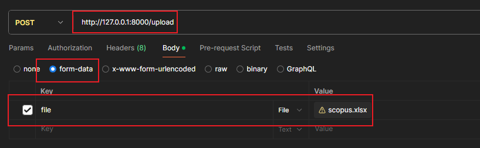
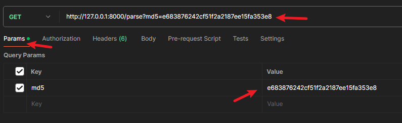

# pyunit-uploadFile

上传文件解析文件到Redis中

# 启动

    git clone https://github.com/pyunits/pyunit-uploadfile
    
    cd pyunit-uploadfile

    docker build -t uploadfile .

    docker run -d --restart=always -e REDIS_IP=xx -e REDIS_PASSWORD=xx -e REDIS_DB=xx -p xx:8000 --name=uploadfile uploadfile

# 在线文档

    http://127.0.0.1:8000/docs

# 上传文件

## 入参



## 返回参数

```json

[
  {
    "name": "scopus.xlsx",
    "md5": "e683876242cf51f2a2187ee15fa353e8",
    "type": "application/vnd.openxmlformats-officedocument.spreadsheetml.sheet"
  }
]
```

# 解析文件

## 入参



## 出参

```json
[
  "e683876242cf51f2a2187ee15fa353e8:00103200",
  "e683876242cf51f2a2187ee15fa353e8:00103300",
  "e683876242cf51f2a2187ee15fa353e8:00103400",
  "e683876242cf51f2a2187ee15fa353e8:00103500",
  "e683876242cf51f2a2187ee15fa353e8:00103600",
  "e683876242cf51f2a2187ee15fa353e8:00103700",
  "e683876242cf51f2a2187ee15fa353e8:00103800",
  "e683876242cf51f2a2187ee15fa353e8:00103900",
  "e683876242cf51f2a2187ee15fa353e8:00104000",
  "e683876242cf51f2a2187ee15fa353e8:00104100",
  "e683876242cf51f2a2187ee15fa353e8:00104200",
  "e683876242cf51f2a2187ee15fa353e8:00104300",
  "e683876242cf51f2a2187ee15fa353e8:00104400",
  "e683876242cf51f2a2187ee15fa353e8:00104500",
  "e683876242cf51f2a2187ee15fa353e8:00104600"
]
```

    其中 返回的 字符串都是 Redis里的key
    每一个key代表100行数据